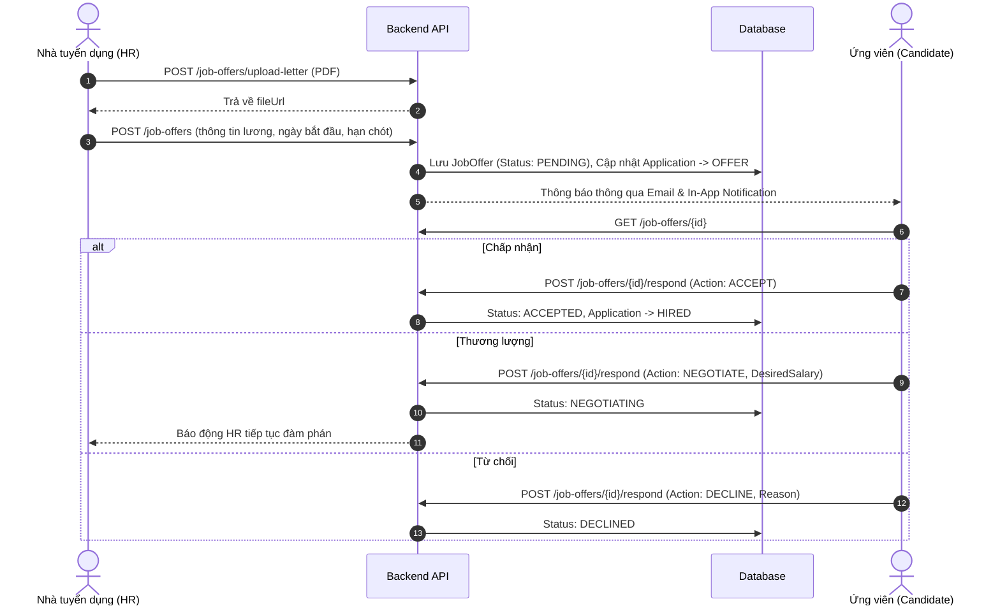

# Phân Hệ Thư Mời Nhận Việc (Job Offers Module)

> **Mã phân hệ**: `OFFER`  
> **Mục tiêu**: Quản lý toàn bộ quy trình phát hành, thương lượng và phản hồi thư mời nhận việc (Job Offer Letter) giữa Doanh nghiệp và Ứng viên.  
> **Liên kết kỹ thuật**: `HR.Domain.Entities.JobOffer`, `JobOffersController`, `CreateJobOfferCommand`, `RespondJobOfferCommand`, `CancelJobOfferCommand`.

---

## 1. Bối cảnh & Mục tiêu nghiệp vụ

Sau khi ứng viên vượt qua các vòng phỏng vấn và kiểm tra năng lực (Technical Test), Nhà tuyển dụng chuyển trạng thái ứng viên sang bước thương lượng hợp đồng và phát hành Thư mời nhận việc (Job Offer). 

### Mục tiêu:
- Tự động hóa tạo và phát hành thư mời làm việc với các điều khoản rõ ràng: Vị trí, Lương cơ bản, Phụ cấp, Thời gian thử việc (% lương thử việc), Quyền lợi, Ngày bắt đầu và Hạn chót phản hồi.
- Đính kèm file PDF Thư mời nhận việc chính thức có chữ ký số/con dấu doanh nghiệp.
- Cho phép Ứng viên tương tác 2 chiều:
  - **Chấp nhận (ACCEPTED)**: Đồng ý nhận việc.
  - **Thương lượng (NEGOTIATING)**: Đề xuất mức lương mong muốn (`CandidateDesiredSalary`) và ghi chú thương lượng.
  - **Từ chối (DECLINED)**: Ghi nhận lý do từ chối để tối ưu hóa chính sách đãi ngộ.
- Hỗ trợ Nhà tuyển dụng thu hồi (CANCELLED) hoặc gia hạn thư mời.

---

## 2. Mô hình dữ liệu (Data Model)

### Bảng `job_offers`

| Tên trường | Kiểu dữ liệu | Ràng buộc | Ý nghĩa |
|---|---|---|---|
| `Id` | `int` | PK, Auto Increment | Mã định danh Offer |
| `ApplicationId` | `int` | FK -> `applications(Id)` | Đơn ứng tuyển tương ứng |
| `JobId` | `int` | FK -> `jobs(Id)` | Tin tuyển dụng |
| `CandidateId` | `int` | FK -> `candidates(Id)` | Ứng viên nhận offer |
| `CreatedByEmployerId` | `int` | FK -> `employers(Id)` | Nhà tuyển dụng phát hành |
| `PositionTitle` | `nvarchar(255)` | Not Null | Chức danh công việc |
| `DepartmentName` | `nvarchar(255)` | Nullable | Phòng ban làm việc |
| `WorkLocation` | `nvarchar(500)` | Nullable | Địa điểm làm việc |
| `WorkingHours` | `nvarchar(255)` | Nullable | Giờ giấc làm việc (e.g. 8:30 - 17:30, T2-T6) |
| `BasicSalary` | `decimal(18,2)` | Not Null | Lương cơ bản chính thức |
| `Allowance` | `decimal(18,2)` | Default 0 | Phụ cấp hàng tháng |
| `SalaryType` | `int / enum` | Default `GROSS` | Phân loại lương (`GROSS` = 0, `NET` = 1) |
| `Currency` | `nvarchar(10)` | Default `'VND'` | Đơn vị tiền tệ (VND, USD) |
| `ProbationPeriodMonths` | `int` | Default 2 | Thời gian thử việc (tháng) |
| `ProbationSalaryPercentage` | `decimal(5,2)` | Default 85.00 | Tỷ lệ lương thử việc (%) |
| `StartDate` | `datetime2` | Not Null | Ngày bắt đầu làm việc dự kiến |
| `ExpiryDate` | `datetime2` | Not Null | Hạn chót ứng viên phản hồi |
| `IssuedAt` | `datetime2` | Default `NOW()` | Thời điểm phát hành |
| `RespondedAt` | `datetime2` | Nullable | Thời điểm ứng viên phản hồi |
| `Benefits` | `nvarchar(max)` | Nullable | Danh sách chế độ phúc lợi (JSON hoặc Text) |
| `SpecialTerms` | `nvarchar(max)` | Nullable | Điều khoản bảo mật, ràng buộc đặc biệt |
| `OfferLetterFileUrl` | `nvarchar(500)` | Nullable | Đường dẫn file PDF thư mời |
| `Status` | `int / enum` | Default `PENDING` | `PENDING` (0), `ACCEPTED` (1), `DECLINED` (2), `NEGOTIATING` (3), `EXPIRED` (4), `CANCELLED` (5) |
| `CandidateResponseNote` | `nvarchar(1000)` | Nullable | Phản hồi của ứng viên |
| `CandidateDesiredSalary` | `decimal(18,2)` | Nullable | Mức lương ứng viên đề xuất khi đàm phán |
| `DeclineReason` | `nvarchar(500)` | Nullable | Lý do ứng viên từ chối |

---

## 3. API Contract (`/api/v1/job-offers`)

| Method | Endpoint | Quyền (Permission) | Mô tả |
|---|---|---|---|
| `POST` | `/api/v1/job-offers` | `job:manage` | Tạo mới và phát hành Job Offer |
| `POST` | `/api/v1/job-offers/upload-letter` | `job:manage` | Upload file PDF Thư mời nhận việc (Max 10MB) |
| `POST` | `/api/v1/job-offers/{id}/respond` | `job:apply` | Ứng viên phản hồi (Đồng ý, Đàm phán, Từ chối) |
| `POST` | `/api/v1/job-offers/{id}/cancel` | `job:manage` | Nhà tuyển dụng thu hồi / hủy thư mời |
| `GET` | `/api/v1/job-offers/{id}` | `Authorize` | Lấy chi tiết thông tin Offer |
| `GET` | `/api/v1/job-offers/application/{appId}` | `Authorize` | Lấy Offer theo đơn ứng tuyển |
| `GET` | `/api/v1/job-offers/employer` | `job:manage` | Lấy danh sách Offer do Employer quản lý |
| `GET` | `/api/v1/job-offers/candidate` | `job:apply` | Lấy danh sách Offer gửi tới Candidate |

---

## 4. Quy trình vận hành & UI Flow

