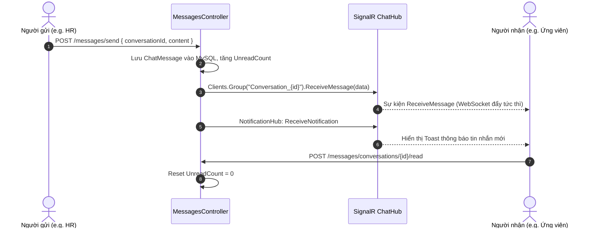

# Phân Hệ Nhắn Tin Trực Tiếp & Trò Chuyện Thời Gian Thực (Chat & Messages Module)

> **Mã phân hệ**: `CHAT`  
> **Mục tiêu**: Cung cấp kênh trao đổi 1-1 thời gian thực (Real-time Chat) giữa Ứng viên và Doanh nghiệp tuyển dụng thông qua SignalR Websockets và REST API.  
> **Liên kết kỹ thuật**: `HR.Domain.Entities.ChatMessage`, `HR.Domain.Entities.Conversation`, `HR.API.Controllers.MessagesController`, `HR.API.Hubs.ChatHub`, `HR.API.Hubs.NotificationHub`.

---

## 1. Bối cảnh & Mục tiêu nghiệp vụ

Giao tiếp nhanh chóng giữa Nhà tuyển dụng và Ứng viên là yếu tố quyết định để giữ chân nhân tài và rút ngắn thời gian tuyển dụng. Phân hệ Chat & Messages cung cấp:
- Hộp thư hội thoại tập trung cho mỗi cặp **Ứng viên - Doanh nghiệp** (tự động hợp nhất các cuộc trò chuyện từ nhiều đơn ứng tuyển khác nhau).
- Gửi và nhận tin nhắn thời gian thực (Real-time) qua WebSocket / SignalR mà không cần reload trang.
- Đếm số tin nhắn chưa đọc (`UnreadCount`) độc lập cho từng bên.
- Tự động kích hoạt thông báo đẩy (Notification) và hiển thị tooltip/badge trên thanh điều hướng.
- Hỗ trợ HR bấm "Shortlist & Chat" ngay tại màn hình duyệt CV để bắt đầu hội thoại với ứng viên kèm lời chào tự động.

---

## 2. Mô hình dữ liệu (Data Model)

### Bảng `conversations`

| Tên trường | Kiểu dữ liệu | Ràng buộc | Ý nghĩa |
|---|---|---|---|
| `Id` | `int` | PK, Auto Increment | Mã cuộc hội thoại |
| `ApplicationId` | `int?` | FK -> `applications(Id)` | Hồ sơ ứng tuyển gần nhất |
| `JobId` | `int?` | FK -> `jobs(Id)` | Vị trí công việc đang thảo luận |
| `CandidateUserId` | `int` | FK -> `users(Id)` | Tài khoản người dùng của Ứng viên |
| `EmployerUserId` | `int` | FK -> `users(Id)` | Tài khoản người dùng của HR/Nhà tuyển dụng |
| `Title` | `nvarchar(255)` | Nullable | Tiêu đề cuộc hội thoại |
| `LastMessageAt` | `datetime2` | Default `NOW()` | Thời gian tin nhắn cuối cùng |
| `LastMessageContent` | `nvarchar(1000)`| Nullable | Trích đoạn nội dung tin nhắn cuối |
| `LastSenderId` | `int` | Nullable | ID người gửi tin nhắn gần nhất |
| `CandidateUnreadCount`| `int` | Default 0 | Số tin nhắn chưa đọc phía Ứng viên |
| `EmployerUnreadCount` | `int` | Default 0 | Số tin nhắn chưa đọc phía Tuyển dụng |

### Bảng `chat_messages`

| Tên trường | Kiểu dữ liệu | Ràng buộc | Ý nghĩa |
|---|---|---|---|
| `Id` | `int` | PK, Auto Increment | Mã tin nhắn |
| `ConversationId` | `int` | FK -> `conversations(Id)` | Thuộc hội thoại nào |
| `SenderId` | `int` | FK -> `users(Id)` | ID tài khoản gửi tin |
| `Content` | `nvarchar(max)` | Not Null | Nội dung tin nhắn |
| `IsRead` | `bit` | Default 0 | Đã đọc chưa |
| `SentAt` | `datetime2` | Default `NOW()` | Thời điểm gửi |

---

## 3. API Contract (`/api/v1/messages`)

| Method | Endpoint | Quyền | Mô tả |
|---|---|---|---|
| `GET` | `/api/v1/messages/conversations` | `Authorize` | Lấy danh sách hội thoại của người dùng |
| `GET` | `/api/v1/messages/conversations/{id}` | `Authorize` | Chi tiết hội thoại và toàn bộ lịch sử tin nhắn |
| `GET` | `/api/v1/messages/by-application/{appId}` | `Authorize` | Lấy hoặc khởi tạo hội thoại từ hồ sơ ứng tuyển |
| `POST` | `/api/v1/messages/send` | `Authorize` | Gửi tin nhắn mới |
| `POST` | `/api/v1/messages/conversations/{id}/read` | `Authorize` | Đánh dấu đã đọc cuộc hội thoại |
| `POST` | `/api/v1/messages/shortlist-and-chat` | `job:manage` | Đưa ứng viên vào Shortlist và mở khung chat |

---

## 4. Kiến trúc Real-time với SignalR

