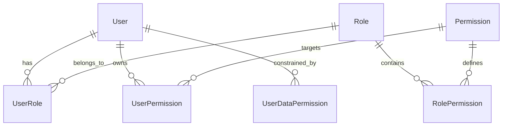

# Phân Hệ Quản Lý Quyền & Phân Quyền Nâng Cao (RBAC & Permissions Module)

> **Mã phân hệ**: `RBAC`  
> **Mục tiêu**: Cung cấp kiến trúc phân quyền dựa trên vai trò (Role-Based Access Control) kết hợp phân quyền chi tiết (Attribute/Permission-Based) và phạm vi dữ liệu (Data Scope Isolation: All, Company, Branch, Personal).  
> **Liên kết kỹ thuật**: `HR.Domain.Entities.Role`, `Permission`, `RolePermission`, `UserPermission`, `UserDataPermission`, `RequirePermissionAttribute`, `UserPermissionsHelper`, `RolesController`, `PermissionsController`.

---

## 1. Bối cảnh & Mục tiêu nghiệp vụ

Một hệ thống HR chuyên nghiệp đòi hỏi phân quyền đa tầng linh hoạt:
- **Vai trò (Roles)**: Nhóm các quyền nghiệp vụ (Admin, HR Director, Recruiter, Interviewer, Candidate...).
- **Quyền hạn (Permissions)**: Cây phân cấp chức năng theo định dạng `resource:action` (ví dụ: `job:view`, `job:create`, `job:update`, `job:manage`, `candidate:view_cv`, `report:export`...).
- **Phạm vi dữ liệu (Data Scopes)**: Giới hạn phạm vi truy cập bản ghi của từng người dùng:
  - `ALL`: Toàn hệ thống (Super Admin).
  - `COMPANY`: Tất cả chi nhánh trong cùng Doanh nghiệp.
  - `BRANCH / SITE`: Chỉ các chi nhánh được phân công phụ trách.
  - `PERSONAL`: Chỉ các bản ghi do chính tài khoản tạo ra hoặc được chỉ định trực tiếp.
- **Kế thừa & Ngoại lệ (Custom Permissions)**: Tự động đồng bộ quyền từ Role xuống `UserPermissions`, nhưng cho phép gán quyền cá nhân hóa (`IsCustom = true`) cho từng nhân viên mà không ảnh hưởng tới toàn bộ Role.

---

## 2. Mô hình dữ liệu (Data Model)



### Các bảng chính:
1. **`roles`**: Danh sách vai trò (`Id`, `Code`, `Name`, `Description`, `Level`, `IsActive`).
2. **`permissions`**: Bảng từ điển quyền hạn (`Id`, `Code`, `Name`, `ParentId`, `Category`, `SortOrder`).
3. **`role_permissions`**: Gán quyền cho vai trò kèm phạm vi mặc định (`RoleId`, `PermissionId`, `DataScope`).
4. **`user_permissions`**: Bộ quyền thực thi hiệu lực của từng người dùng (`UserId`, `PermissionId`, `DataScope`, `IsCustom`).
5. **`user_data_permissions`**: Giới hạn ID chi nhánh/phòng ban mà user được phép xem (`UserId`, `ScopeType`, `ScopeEntityId`).

---

## 3. Kiểm soát quyền tại tầng API

Backend sử dụng custom action filter `[RequirePermission]`:

```csharp
[HttpPost]
[RequirePermission("job:manage")]
public async Task<IActionResult> CreateJob(...)
```

Nếu tài khoản không có quyền trong JWT claim hoặc `user_permissions`, hệ thống trả về HTTP `403 Forbidden` (`INSUFFICIENT_PERMISSIONS`).

---

## 4. API Contract (`/api/v1/roles` & `/api/v1/permissions`)

| Method | Endpoint | Quyền | Mô tả |
|---|---|---|---|
| `GET` | `/api/v1/permissions/tree` | `user-role:view_tree` | Lấy cây phân cấp toàn bộ quyền trong hệ thống |
| `GET` | `/api/v1/roles` | `user-role:view` | Danh sách vai trò kèm bộ lọc phân trang |
| `GET` | `/api/v1/roles/levels` | `user-role:view` | Lấy danh sách cấp bậc vai trò |
| `GET` | `/api/v1/roles/{id}` | `user-role:view` | Xem chi tiết vai trò và danh sách quyền gán |
| `POST` | `/api/v1/roles` | `user-role:manage` | Tạo mới vai trò |
| `PUT` | `/api/v1/roles/{id}` | `user-role:manage` | Chỉnh sửa tên, mô tả vai trò |
| `DELETE` | `/api/v1/roles/{id}` | `user-role:manage` | Xóa vai trò |
| `PUT` | `/api/v1/roles/{id}/permissions`| `user-role:manage` | Cập nhật ma trận quyền cho vai trò & tự động sync tới user |
