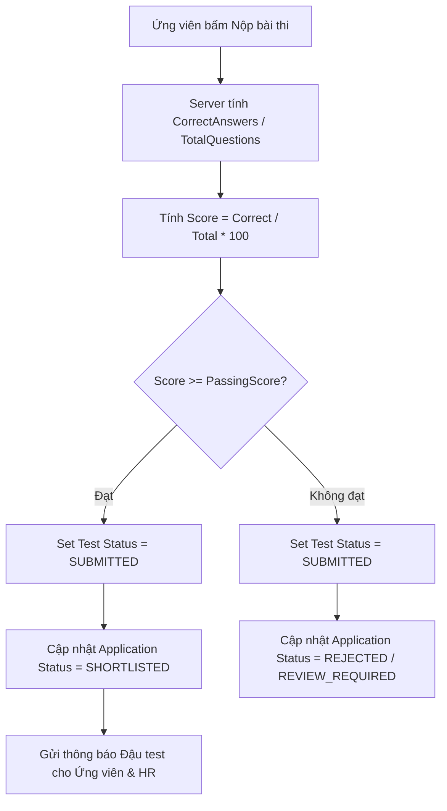

# Phân Hệ Bài Kiểm Tra Năng Lực Trực Tuyến & Chấm Điểm AI (Technical Tests Module)

> **Mã phân hệ**: `TEST`  
> **Mục tiêu**: Đánh giá kiến thức chuyên môn, kỹ năng lập trình / nghiệp vụ của ứng viên thông qua bài kiểm tra trắc nghiệm & tự luận online, hỗ trợ AI sinh đề thi tự động từ JD và tự động chấm điểm.  
> **Liên kết kỹ thuật**: `HR.Domain.Entities.TechnicalTest`, `TechnicalTestsController`, `GenerateAiQuestionsCommand`, `InviteCandidateTestCommand`, `StartTestCommand`, `SubmitTestCommand`.

---

## 1. Bối cảnh & Mục tiêu nghiệp vụ

Để giảm thiểu chi phí và thời gian phỏng vấn trực tiếp cho các ứng viên chưa đáp ứng yêu cầu chuyên môn cơ bản, hệ thống cung cấp công cụ kiểm tra năng lực trực tuyến:
- **Tự động tạo câu hỏi bằng AI**: Phân tích Job Description (JD), yêu cầu kỹ năng và cấp bậc công việc để AI tự động sinh ngân hàng câu hỏi trắc nghiệm (Multiple Choice) kèm giải thích chi tiết.
- **Mời ứng viên**: HR gửi email + thông báo đính kèm liên kết làm bài thi với thời hạn cụ thể.
- **Làm bài trực tuyến bảo mật**: Ẩn toàn bộ đáp án đúng khi tải đề thi xuống client, tính giờ chính xác theo Server-side timestamp từ lúc gọi `StartTest`.
- **Chấm điểm tự động & Quy tắc kích hoạt**: Tự động so khớp câu trả lời, tính % điểm đạt được (`Score`). Nếu `Score >= PassingScore`, hệ thống tự động thăng cấp trạng thái ứng tuyển sang `SHORTLISTED` và mở quyền đặt lịch phỏng vấn tiếp theo.

---

## 2. Mô hình dữ liệu (Data Model)

### Bảng `technical_tests`

| Tên trường | Kiểu dữ liệu | Ràng buộc | Ý nghĩa |
|---|---|---|---|
| `Id` | `int` | PK, Auto Increment | Mã bài test |
| `ApplicationId` | `int` | FK -> `applications(Id)` | Hồ sơ ứng tuyển liên quan |
| `Title` | `nvarchar(255)` | Not Null | Tiêu đề bài kiểm tra |
| `TestType` | `int / enum` | Default `TECHNICAL` | Loại bài thi (`TECHNICAL`, `LOGIC`, `LANGUAGE`, `CULTURE_FIT`) |
| `DurationMinutes` | `int` | Default 30 | Thời lượng làm bài (phút) |
| `PassingScore` | `int` | Default 70 | Điểm chuẩn vượt qua (thang 100) |
| `TotalQuestions` | `int` | Default 0 | Tổng số câu hỏi trong bài |
| `CorrectAnswersCount` | `int` | Default 0 | Số câu ứng viên trả lời đúng |
| `Score` | `int` | Default 0 | Điểm tổng kết (thang 100) |
| `Status` | `int / enum` | Default `PENDING` | Trạng thái (`PENDING`, `IN_PROGRESS`, `SUBMITTED`, `EXPIRED`) |
| `StartTime` | `datetime2` | Nullable | Thời điểm ứng viên nhấn nút Bắt đầu |
| `SubmittedAt` | `datetime2` | Nullable | Thời điểm ứng viên nộp bài |
| `QuestionsData` | `nvarchar(max)` | JSON | Snapshot danh sách câu hỏi, lựa chọn A/B/C/D, đáp án đúng và giải thích |
| `AnswersData` | `nvarchar(max)` | JSON | Danh sách câu trả lời ứng viên đã chọn |
| `Notes` | `nvarchar(1000)` | Nullable | Nhận xét của hệ thống hoặc giám khảo |

---

## 3. API Contract (`/api/v1/technical-tests`)

| Method | Endpoint | Mô tả |
|---|---|---|
| `POST` | `/api/v1/technical-tests/template` | Lưu / cấu hình mẫu đề thi gắn với tin tuyển dụng |
| `GET` | `/api/v1/technical-tests/template/{jobId}` | Lấy cấu hình đề thi của một công việc |
| `POST` | `/api/v1/technical-tests/generate-questions` | AI tự động sinh đề thi trắc nghiệm từ JD |
| `POST` | `/api/v1/technical-tests/invite` | Gửi lời mời làm bài thi cho ứng viên |
| `GET` | `/api/v1/technical-tests/{testId}/take` | Ứng viên lấy đề thi (ẩn đáp án đúng) |
| `POST` | `/api/v1/technical-tests/{testId}/start` | Khởi tạo thời gian bắt đầu làm bài |
| `POST` | `/api/v1/technical-tests/{testId}/submit` | Nộp bài thi, tự động tính điểm |
| `GET` | `/api/v1/technical-tests/{testId}/result` | Xem bảng điểm chi tiết và đáp án |
| `GET` | `/api/v1/technical-tests/by-job/{jobId}` | Danh sách bảng điểm của mọi ứng viên cho công việc |

---

## 4. Cơ chế chấm điểm và Chuyển trạng thái tự động

